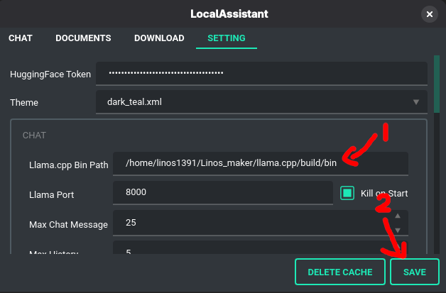

## Pre-install

Before installing, please make sure to acquire **Llama.cpp** beforehand (install instruction [here](https://llama-cpp.com/getting-started/)).

<br>

## Installing

Download [locas_installer.py](https://github.com/Linos1391/LocalAssistant/releases/download/v2.0.0rc1/locas_installer.py), and let magic happens.

| Window                    | Unix                       |
| ------------------------- | -------------------------- |
| python locas_installer.py | python3 locas_installer.py |

Let's go through all questions!

<br>

### Question 1: Choose path

```
Please choose the path for LocalAssistant. [...]:
```

Now, path is where you want LocalAssistant to be.

```
Your path
│
├─── .venv <dir - a python virtual environment>
│
├─── docs <dir - to store documents for retrieving process>
│
├─── histories <dir - to store histories used within chat>
│
├─── models <dir - where installed models is stored>
│
├─── llama.log <file - log file for llama.cpp>
│
├─── locas.log <file - log file for localassistant>
│
├─── setting.json <file - setting config file>
│
└─── locas / locas.cmd <file - script to use `locas` anywhere>
```

Choose the folder, copy its path *(`Ctrl+Shift+C` for Window or `Ctrl+C` for most Unix OS)*, and paste it in. If leaving it empty, the path will be that inside the bracket `[...]`.

**Notice:** It may ask for comfirmation when folder is already existed.

<br>

### Question 2: Choose version

```
Available version: ...
  Pre-release version: ...
  Latest version: ...
Which version to install [...]:
```

All version that got published will be shown. Choose the one that fill your need. Leave empty for the latest version.

<br>

### Question 3: Paste Llama.cpp bin path *(Skipped if upgrading)*

```
Paste in the path to installed llama.cpp bin (.../build/bin):
```

Paste the Llama.cpp bin path you just installed. Remember, it is essential or else the app will fail.

**You can always change the path within the Setting tab!**



Open the app by type in `locas` within the terminal.

```
locas
```

Go to the setting tab and paste the Llama.cpp bin path you just installed. (.../build/bin)

Save the setting and enjoy.

<br>

### Question 4: Install starter models *(Skipped if upgrading)*

```
Do you want to install starter models ([Y]/n):
```

Recommend to choose yes, please type `n` if you do not want to.

Models that will be installed:
| Repo id                                          | Description                                                       |
| ------------------------------------------------ | ----------------------------------------------------------------- |
| unsloth/Qwen3.5-0.8B-GGUF/Qwen3.5-0.8B-BF16.gguf | BF16 version of Qwen3.5 0.8B, used for llama.cpp                  |
| unsloth/Qwen3.5-0.8B-GGUF/mmproj-BF16.gguf       | BF16 version of mmproj of Qwen3.5 0.8B, enable vision for Qwen3.5 |
| Qdrant/clip-ViT-B-32-text                        | Fastembed dense embedder, multimodel (text&image)                 |
| Qdrant/bm25                                      | Fastembed sparse embedder, use BM25                               |
| Qdrant/clip-ViT-B-32-vision                      | Fastembed image embedder, multimodel (text&image)                 |

<br>

## Updating

What you need is installing localassistant again on the path where needed to be upgraded *(Question 1)*. Your existed assets won't be touched during this process.

<br>

## Uninstalling

If you follow the instruction above, all you have to do is delete the folder.

However, the `$PATH` for global access is still there, you have to manually delete it.

- Window: Same in [wikiHow](https://www.wikihow.com/Change-the-PATH-Environment-Variable-on-Windows) but remove the path to your `locas` 
- Unix: Navigate to your shell startup file (eg: .bashrc, .zshrc, etc.) and remove the `export` line.
